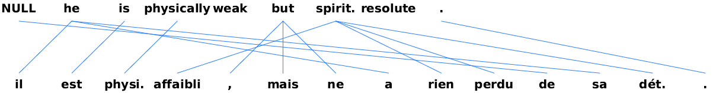
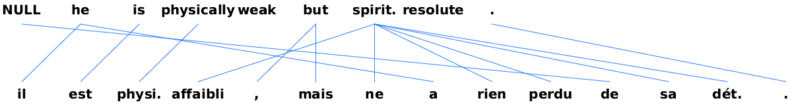

# Projects for the Natural Language Processing 2 Course, University of Amsterdam
## Authors: Adriaan de Vries, Verna Dankers, Féliciën Veldema

### Project 1: Evaluating IBM alignment models

For the first project we implemented IBM 1 and IBM 2, along with the Variational Bayes and Expectation Maximisation optimisation algorithms.
The models are trained using data from a parallel corpus. Code to read in the data can be found in the file ```data.py```.
Words occurring once are mapped to the token '-UNK-'.
Code to evaluate alignments found is given in the file ```aer.py```.
The models themselves are implemented in interactive jupyter notebooks:
1. ```IBM1-EM.ipynb```
2. ```IBM1-VB.ipynb```
3. ```IBM2-EM.ipynb```
4. ```IBM2-VB.ipynb```

Run the notebooks one by one to retrain the models. Performance on the testing data is presented in the NAACL format in the folder ```test_results```.

The following image presents an example alignment for IBM1 VB:

The following image presents an example alignment for IBM1 EM:


The results on test data were the following:

<table class="tg">
  <tr>
    <th class="tg-us36">Model</th>
    <th class="tg-us36">Training</th>
    <th class="tg-us36">Selection</th>
    <th class="tg-us36">AER<br></th>
  </tr>
  <tr>
    <th class="tg-us36">IBM 1</th>
    <th class="tg-us36">MLE</th>
    <th class="tg-us36">AER</th>
    <th class="tg-us36">0.2852<br></th>
  </tr>
  <tr>
    <td class="tg-us36">IBM 1</td>
    <td class="tg-us36">VB</td>
    <td class="tg-us36">AER</td>
    <td class="tg-us36">0.2866</td>
  </tr>
  <tr>
    <td class="tg-us36">IBM 1</td>
    <td class="tg-us36">MLE</td>
    <td class="tg-us36">LL</td>
    <td class="tg-us36">0.2856</td>
  </tr>
  <tr>
    <td class="tg-us36">IBM 1</td>
    <td class="tg-us36">VB</td>
    <td class="tg-us36">ELBO</td>
    <td class="tg-us36">0.2863</td>
  </tr>
  <tr>
    <td class="tg-us36">IBM 2</td>
    <td class="tg-us36">MLE</td>
    <td class="tg-us36">AER</td>
    <td class="tg-us36">0.2068</td>
  </tr>
  <tr>
    <td class="tg-us36">IBM 2</td>
    <td class="tg-us36">VB</td>
    <td class="tg-us36">AER</td>
    <td class="tg-us36">0.2054</td>
  </tr>
  <tr>
    <td class="tg-us36">IBM 2</td>
    <td class="tg-us36">MLE</td>
    <td class="tg-us36">LL</td>
    <td class="tg-us36">0.2047</td>
  </tr>
  <tr>
    <td class="tg-us36">IBM 2</td>
    <td class="tg-us36">VB</td>
    <td class="tg-us36">ELBO</td>
    <td class="tg-us36">0.2036</td>
  </tr>
</table>